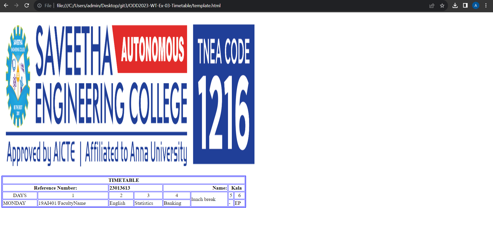

# Ex-04-Timetable
## AIM
To Write a html webpage page to display your timetable.
# name:abdullah.R
# referencenumber:23013613
# ALGORITHM
### STEP 1
create a simple table using table tag
### STEP 2
Add header row using th tag
### STEP 3
Add your timetable
### STEP 4
Execute the program

# CODE
``````
<html>
  <head>
  </head>
  <body> 
  
  <table border="2" width=50% height= 10% bordercolor="blue" >
    <tr> 
    <th colspan ="10">TIMETABLE</th>  
    </tr> 
    <tr> 
    <th colspan="2">Reference Number:</th> 
    <th  style="text-align: left" colspan="2">23013613</th> 
    <th  style="text-align:right" colspan="2"> Name:</th> 
    <th colspan="2">Kala</th>
    
    </tr> 
    <tr> 
    <td style="text-align: center";>DAYS</td> 
    <td  style="text-align: center";>1</td>
    <td  style="text-align: center";>2</td>
    <td  style="text-align: center";>3</td> 
    <td  style="text-align: center";>4</td>
    <td rowspan="2"  style="text-align: center";>  lunch break </td></td>
    <td  style="text-align: center";>5</td>
    <td  style="text-align: center";>6</td>
    </tr> 
    <tr> 
    <td style="text-align: center";>MONDAY</td> 
    <td style="text-align: center">19AI401/FacultyName</td>
    <td style="text-align: center">English</td>
    <td style="text-align: center">Statistics</td>
    <td style="text-align: center">Banking</td> 
    <td style="text-align: center">-</td>
    <td style="text-align: center">EP</td>
    
    
    </tr> 
     
    
  </body>
</html>
``````

### output:



### result:
The result is verified sucessfully


